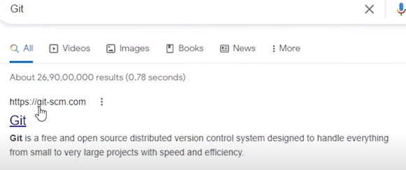
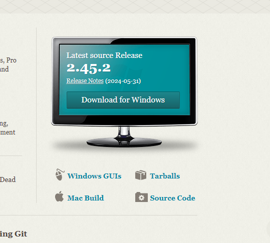
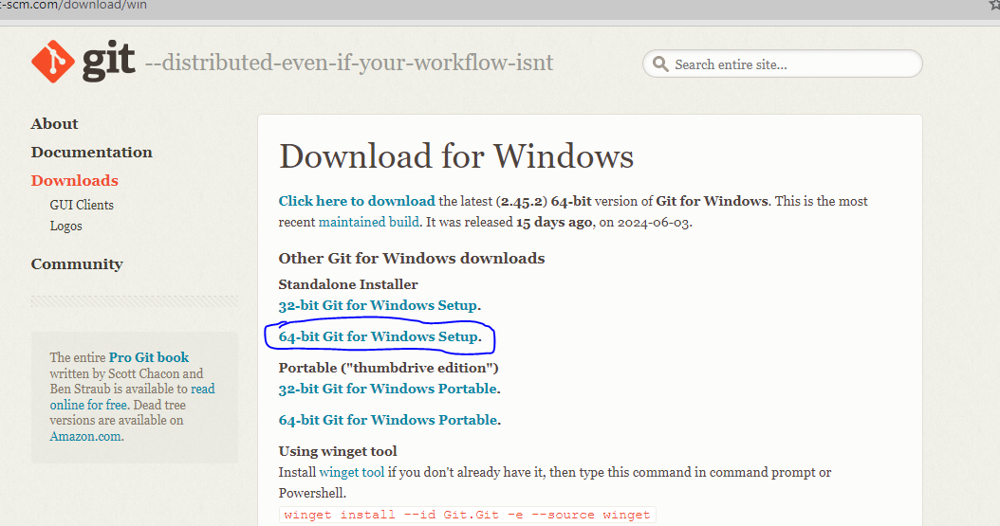
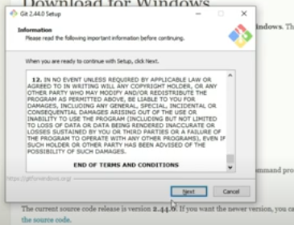
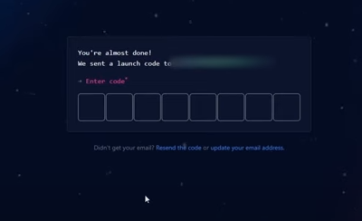
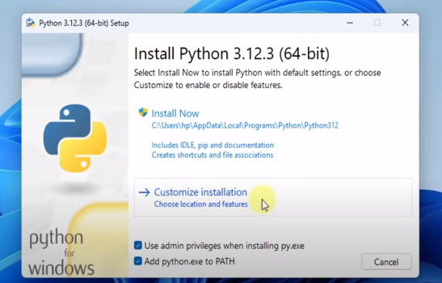
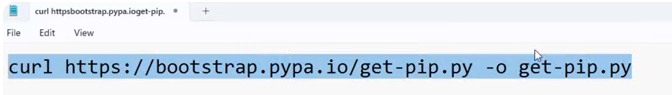
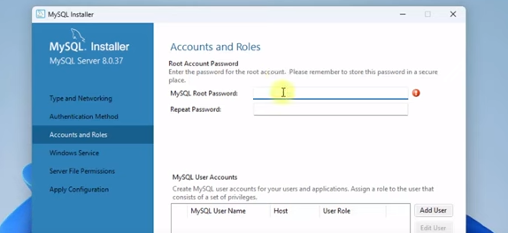

# Dev_Setup
Setup Development Environment

#Assignment: Setting Up Your Developer Environment

#Objective:
This assignment aims to familiarize you with the tools and configurations necessary to set up an efficient developer environment for software engineering projects. Completing this assignment will give you the skills required to set up a robust and productive workspace conducive to coding, debugging, version control, and collaboration.

#Tasks:

1. Select Your Operating System (OS):
   Choose an operating system that best suits your preferences and project requirements. Download and Install Windows 11. https://www.microsoft.com/software-download/windows11

2. Install a Text Editor or Integrated Development Environment (IDE):
   Select and install a text editor or IDE suitable for your programming languages and workflow. Download and Install Visual Studio Code. https://code.visualstudio.com/Download
3. Set Up Version Control System:
   Install Git and configure it on your local machine. Create a GitHub account for hosting your repositories. Initialize a Git repository for your project and make your first commit. https://github.com

4. Install Necessary Programming Languages and Runtimes:
  Instal Python from http://wwww.python.org programming language required for your project and install their respective compilers, interpreters, or runtimes. Ensure you have the necessary tools to build and execute your code.

5. Install Package Managers:
   If applicable, install package managers like pip (Python).

6. Configure a Database (MySQL):
   Download and install MySQL database. https://dev.mysql.com/downloads/windows/installer/5.7.html

7. Set Up Development Environments and Virtualization (Optional):
   Consider using virtualization tools like Docker or virtual machines to isolate project dependencies and ensure consistent environments across different machines.

8. Explore Extensions and Plugins:
   Explore available extensions, plugins, and add-ons for your chosen text editor or IDE to enhance functionality, such as syntax highlighting, linting, code formatting, and version control integration.

9. Document Your Setup:
    Create a comprehensive document outlining the steps you've taken to set up your developer environment. Include any configurations, customizations, or troubleshooting steps encountered during the process. 

#Deliverables:
- Document detailing the setup process with step-by-step instructions and screenshots where necessary.
- A GitHub repository containing a sample project initialized with Git and any necessary configuration files (e.g., .gitignore).
- A reflection on the challenges faced during setup and strategies employed to overcome them.

#Submission:
Submit your document and GitHub repository link through the designated platform or email to the instructor by the specified deadline.

#Evaluation Criteria:**
- Completeness and accuracy of setup documentation.
- Effectiveness of version control implementation.
- Appropriateness of tools selected for the project requirements.
- Clarity of reflection on challenges and solutions encountered.
- Adherence to submission guidelines and deadlines.

Note: Feel free to reach out for clarification or assistance with any aspect of the assignment.

DEVELOPER ENVIRONMENT SETUP DOCUMENT.

Introduction;

This document outlines the steps I have taken to set up a developer environment on Windows 11 for software engineering projects. The objective is to establish a workspace conducive to coding, version control, and collaboration.

Operating system installation.
Windows 11.
Installation of windows 11;
Search 'how to download windows 11' on your browser and search for download windows 11 .
Click the 'Download windows 11' link' (https://www.microsoft.com/software-download/windows11) .
I will download the'Create windows 11 installation media' by clicking the 'download now' button 
Once completed it will bring the windows 11 set up page for installion as shown below in the screenshots:
 Here accept the user license agreement.
 .
Choose which media you want to download the OS where in my case I used an 8GB blank flash drive or format it
  .
 Insert your flash drive in your pc and then go back to the installation and click 'next' . 
 Afterwards click on next then download will start ,  , ,  .
 Once the process is done click on finish  .
Afterwards I installed Windows on my laptop from the flash drive.

Text Editor/IDE Installation.
Visual Studio Code.
Download and Installation of Vs code;
Open your browser and search visual studio code download and click the link that will appear (https://www.microsoft.com/software-download/windows11) .
Click on windows to download the Vs code since I am using windows OS .
Once it is downloaded a user license agreement will appear which you will click on the 'i accept the agreement' then click 'next'  .
You will be shown where the vs code will be installled then click 'next'  .
It will create a visual studio file which is fine click 'next' 
Select all the option in additional tasks the click 'next'  .
From here it will be ready to install so click 'install'   .
Once it is done click on finish  .
Here you will be able to launch your vs code and you can search for it if you want to access it on the search bar by writing'visual studio code' .
You can also download key extensions you like here on vs code  .

Version Control Setup;

Git Installation.
Type Git on your web browser and click on the first link that will appear 
 .
You will be taken to Git official website!  .
You will the click ' download for windows' to download  .
You can also download the documentation which is very helpful especially 'progit'.
From there dowload the 64-bit Git for windows setup, Standallone installer where it will start to download.
Afterward the user agreement will appear where you will read it and click 'next' .
Then the location where the file will be stored is shown and if you do not like it one can change afterwards click on'next' .
From here click on 'next' until you are asked to choose an IDE for Git where you can choose Visual studio code since I already downloaded it.
Click on 'next' untill you reach ready to install where you will click 'install' for it to install .
then click on 'finish' to finish 
To confirm if it has been install write'git' in command prompt then press 'enter' where all git commands will be shown  .

Github Account.
Type 'github.com' on your web browser and click on the link (https://github.com)  .
From here you will sign app by clicking 'sign up' button and you will sign up using your email and create a password and also write your prefferd user name. .
Then you will be to verify that you are not a robot  in order to install.
A code will be sent to the email that you will use for github  .
Github will ask some questions like how long will you use it.
Afterwards you will be able to access your github account .

Programming language.
Python Installation.
Go to your web browser and type 'python' wher you will click on the link(http://wwww.python.org) .
You will be taken to there offiial webpage where you will click 'download' and download the latest python version. .
After download it is time to install by customizing my own installation as shown in the screenshots:
 .
 .
When you reach advanced options you will click 'install python 3.12 to all users' and then install.
 .
Once python is installed then you can confirm it through command prompt by typing 'pyhton --version'
 .
You can also try to write a command in the command prompt by typing'py'

Install Package Managers.
PIP Installation.
Copy the command in the screenshot below to the command prompt to be able to get pip  . and paste 
Then type the command 'python get-pip.py' to install pip.
Afterwards set the environment variables for pip, This may be different depending on your python version.
Confirm if pip is installed by going to command prompt and type 'pip --version'  .

Download and Installation of Database.
Downloading and Installing MySQL.
Type 'MySQL' on your browser where you click the link below to be able to go to MySQL official website (https://dev.mysql.com/downloads/windows/installer/5.7.html) .
From there click the second download option to be able to download MySQL  .
From ther click 'No, thanks just start my download'  .
I did the following customization to install MySQL Aas shown in the screenshots below:
 then click 'next' .
Choose the products you want to install then click 'next'  .
'Execute' the redistributable packages if you dont have then click 'next'  .
Then MySQL Server, Workbenck and Shell will be installed.  .
Click 'next' untill you reach to set your password  .
Click 'next' untill you reach apply configuration where you will click 'execute' 
Click 'finish' to finish installation, here MySQL Workbench and Shell will automatically be opened.
Set the path for MySQL through 'Edit environment variables'
Verify installation in the command prompt  .

Extensions and Pluggins.
Go to your IDE(Visual Studio Code) and install the various extensions and pluggins you want such as for pylance pressing'Ctrl + Shift + X' , .

Challenges faced during setup.
The main challenge I faced was downloading MySQL where I decided to delete it after I installed it wrongly but forgot to delete the paths. Since I had not deleted the paths when i went to install it again I found an error so I could not continue and had to delete the one I downloaded second. Before downloading a third and last time I decided to delete the paths by going to the program file and program data and delete the MySQL paths. I also had to delete the redistributables in order to avoid errors and download them again while installing MySQL a third time.